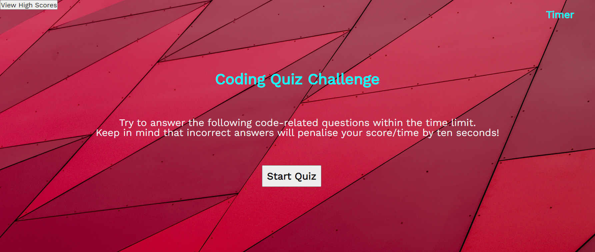
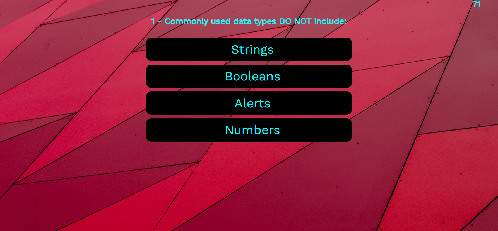

# JavaScript Quiz Challenge

## Table Of Contents
*[General Info](#general-info)
*[Website URL](#URL)
*[Screenshots](#screnshots)
*[Code](#code)
*[Status](#status)

## General Info
Weekely challenge was to create a quiz that will pose questions on JavaScript coding language and present multiple choice answers. A 75 second timer will start when the user begins the quiz and time will be deducted (10 second) when  they answer a question wrong. Scores will be calculated from time remaining at the end of the quiz.

Criteria:
GIVEN I am taking a code quiz
WHEN I click the start button
THEN a timer starts and I am presented with a question
WHEN I answer a question
THEN I am presented with another question
WHEN I answer a question incorrectly
THEN time is subtracted from the clock
WHEN all questions are answered or the timer reaches 0
THEN the game is over
WHEN the game is over
THEN I can save my initials and score

## Website URL
[JavaScript Quiz](https://guyjiawei.github.io/js-quiz/)

## Screenshots

## Code 
* HTML
* CSS
* JavaScript

## Status
Project is complete and deployed.